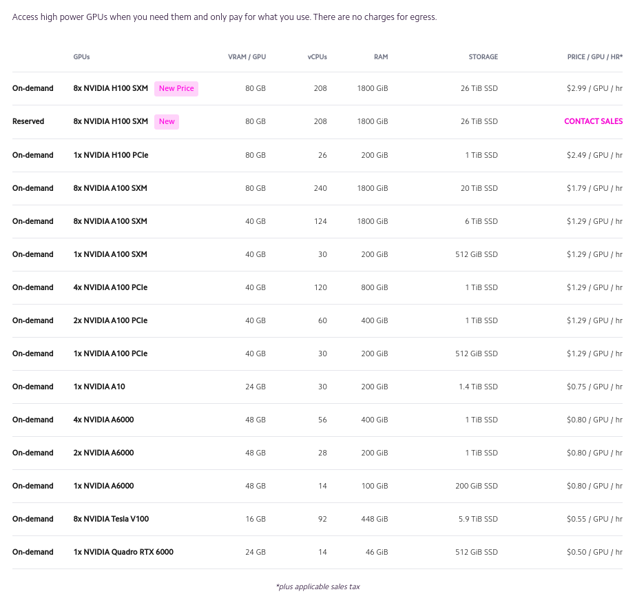
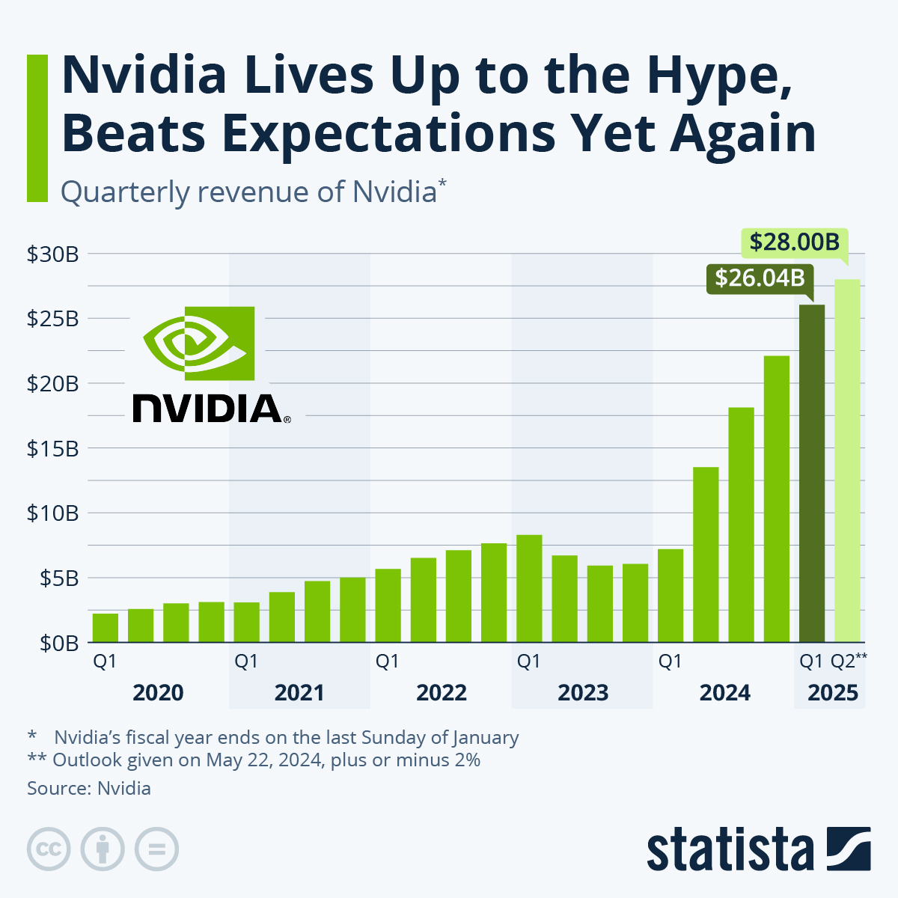

* TOC
{:toc}

# Introduction
Les GPUs (carte graphiques) permettent d'accélérer les calculs nécessaires pour l'entraînement de modèles d'IA. Pourquoi ? Pour trois raisons principales:  
- Les GPUs sont conçus pour effectuer des calculs en parallèle, hors les architectures les plus courantes (neurones, tranformers, ...) sont fortement parallélisables. Dans les faits, la plupart des opérations pendant l'entrainement ou l'utilisation de modèles sont des multiplications de grandes matrices. A l'inverse, les CPUs sont conçus pour effectuer des calculs en série sur seulement quelques coeurs.
- Certains coeurs de GPUs (ex: *CUDA cores* pour NVIDIA) sont spécialement faits pour les calculs à base de flottants (*float*), majoritairement utilisés dans les calculs.
- La VRAM offre un espace dédié pour stocker de grandes quantités de données, permettant au GPU de les accéder rapidement sans encombrer la mémoire principale du système. Combinée à une largeur de bande mémoire élevée, elle permet au GPU de traiter simultanément des matrices de données massives, accélérant considérablement les tâches de deep learning par rapport à un CPU.
C'est pour ces raisons qu'au moment d'achetet un GPU il est important de lire les spécifications techniques, et non seulement le numéro de modèle. La VRAM et le nombre de *CUDA cores* sont absolument essentiels pour les tâches d'IA.  
  
Le problème est que les GPUs sont chers, et que seul NVIDIA propose des cartes graphiques (voir [Etat du marché](#etat-du-marché)) optimisées pour les calculs d'IA. La concurrence est donc faible, et les prix élevés...  

IL existe cependant quelques solutions pour accéder à des GPUs sans avoir à en acheter un, la plus utile étant souvent d'[utiliser les GPUs de l'école](#utiliser-les-gpus-de-lecole).  
Pour les taches les plus puissantes, pas le choix, il faut passer par un [service cloud](#utiliser-un-service-cloud).  

# Utiliser son propre GPU
La première solution, et la plus simple, est d'utiliser son propre GPU. Si vous avez un ordinateur avec une carte graphique Nvidia, vous pouvez installer les drivers CUDA et cuDNN pour utiliser votre GPU pour vos projets d'IA. Pour plus de détails sur comment débuter, allez voir la page [Se mettre au développement](../pages/dev.md).  

Si vous avez **une carte graphique AMD**, la situation est plus compliquée. Il est impossible d'approcher les performances de NVIDIA avec une carte graphique AMD. Ainsi, faire tourner un modèle de génération de texte ou d'images en local sous AMD est un vrai défi (je ferrai peut-être un tutoriel un jour).  

Pour le développement, il est compliqué d'utiliser des bibliothèques de deep learning sur une carte graphique AMD. Si vous souhaitez quand même essayer, voici quelques pistes:  

Vous pouvez être intéréssée par [DirectML](https://github.com/microsoft/DirectML) qui vous permet d'utiliser PyTorch et TensorFlow sur votre GPU AMD mais uniquement sur Windows et sur WSL2. Le support et les performances sont correctes, mais bien inférieurs à ceux de CUDA.

L'alternative officielle est **[ROCm](https://rocm.docs.amd.com/projects/install-on-linux/en/latest/install/quick-start.html) sour Linux**, un équivalent de CUDA pour les cartes graphiques AMD. Le performances et le support de ROCm sont cependant bien inférieurs à ceux de CUDA, mais PyTorch et TensorFlow le supporte. Attendez vous cependant à des problèmes de compatibilité...  
La meilleure solution est alors malheureusement d'utiliser un service cloud.  
> NB: [ROCm est en train d'arriver sur Windows](https://rocm.docs.amd.com/en/docs-5.5.1/release/windows_support.html), mais que les bibliothèques de deep learning (PyTorch, TensorFlow) ne sont pas encore supportées.

# [Utiliser les GPUs de l'école](#utiliser-les-gpus-de-lecole)

Le département INFRES met à dispositions des étudiants et chercheurs quelques GPUs. A la rentrée 2024, ceux-ci se composent ainsi:

| Nom   | GPU Type                   | Quantité      | Mémoire     | Accès    |
|-------|----------------------------|---------------|-------------|----------|
| gpu1  | K80                        | 4             | 12 GB       | Autorisé |
| gpu2  | V100                       | 3             | 16 GB (x2), 32 GB (x1) | Autorisé |
| gpu3  | V100s                      | 3             | 32 GB       | Autorisé |
| gpu4  | A100                       | 3             | 40 GB       | Refusé   |
| gpu5  | A100                       | 3             | 40 GB       | Refusé   |
| gpu6  | A100                       | 3             | 40 GB       | Refusé   |
| gpu7  | K80                        | 4             | 12 GB       | Autorisé |
| gpu8  | K80                        | 4             | 12 GB       | Autorisé |
| gpu9  | K80                        | 2             | 12 GB       | Autorisé |

> Les GPUs 4 à 6 sont réservés aux doctorants et chercheurs. Ils ne sont plus accessibles aux élèves.

## Comment se connecter

Les GPUs sont accesibles **uniquement depuis le réseau interne**. Si vous souhaitez y accéder de l'exterieur, il vous faudra **[utiliser le vpn de l'école]**(https://eole.telecom-paris.fr/vos-services/services-numeriques/connexions-aux-reseaux#exterieur), simple d'installation, c'est une très bonne solution.

Une fois le vpn installé, vous pouvez vous connecter aux GPUs en utilisant ssh en utilisant votre login et mot de passe de l'école. Par exemple, pour vous connecter au gpu1, utilisez la commande suivante:  

```bash
ssh <votre_login>@gpu1.enst.fr
```

Vous devrez ensuite entrer votre mot de passe. Vous êtes alors connecté !

> Pour avoir la liste des serveurs, vous pouvez aller sur [lames.enst.fr](lames.enst.fr). Le *DASHBOARD INFRES* vous donnera la liste des CPUs et leur utilisation, le *DASHBOARD GPU* vous donnera la liste des GPUs et leur utilisation.

## Bonnes pratiques et utilisation

En premier lieu, **il est important de ne pas monopoliser les GPUs**. Ceux-ci servent principalement aux doctorants et chercheurs, il serait dommage de perdre l'accès à cause de un ou deux élèves qui font n'importe quoi.

Pour veiller à cela, **quelques bonnes pratiques s'imposent:**  
Une fois connecté, vous pouvez voir l'utilisation des GPUs en tapant la commande suivante:

```bash 
nvidia-smi
```

Vous verrez alors l'utilisation des GPUs, et pourrez voir si un GPU est libre ou non. Si vous voyez que tous les GPUs sont utilisés, il est préférable d'attendre un peu ou de changer de machine.

Si certains ne sont pas utilisés, choisissez en **un ou deux, pas plus** et entrez la commande suivante pour voir uniquement ces GPUs:

> Pour les utilisations de plus de 3h, la DSI demande d'utiliser un seul GPU.

```bash
export CUDA_VISIBLE_DEVICES=0,1 # Pour réserver les GPUs 0 et 1
```

Une fois votre script lancé, vous pouvez voir l'utilisation de votre GPU en temps réel en retapant:

```bash
nvidia-smi
```

Cela permet également de voir si votre choix de GPU à fonctionné.

Enfin, il est important de **ne pas laisser de processus tourner inutilement**. Si vous avez fini votre entrainement, arrêtez le processus pour libérer le GPU, **personne ne le fera pour vous**.

## Remarques utiles

L'espace disque auquel vous accédez par défaut **est partagé entre les machines et les utilisateurs**. Au moment de la rentrée 2024, il semble y avoir 27 To de stockage libre, et il ne semble pas avoir de limite par utilisateur. Il faut donc faire attention à ne pas abuser de cet espace en stockant trop de données. *Notez qu'un script mal configuré/arreté peut rapidement remplir l'espace disque...*  

**Pour vos programmes python, il est recommandé d'utiliser un environnement virtuel **pour installer les bibliothèques nécessaires. Pour plus d'informations, vous pouvez consulter la page [Se mettre au développement](../pages/dev.md).

**Pour transférer des fichiers**, vous pouvez utiliser `scp` sur votre machine pour copier des fichiers depuis votre machine vers le serveur, ou depuis le serveur vers votre machine. Voici un exemple pour copier un fichier depuis votre machine vers le serveur:

```bash
scp /chemin/vers/votre/fichier <votre_login>@gpu1.enst.fr:/chemin/vers/destination # local vers serveur, inverse pour serveur vers local
```

> **typiquement, /chemin/vers/votre/destination est `~`** pour votre dossier personnel (celui sur lequel vous arrivez en vous connectant).
  
Si vous souhaitez faire tourner des programmes en arrière plan, **il est préférable d'utiliser `tmux`** (alternative à `screen`) pour détacher la session de votre terminal, et la laisser tourner en arrière plan. Voici les commandes de base pour utiliser `tmux`:

- `tmux new -s <nom>`: Crée une nouvelle session le nom `<nom>` et cous y connecte, `tmux` pour une session sans nom spécifique.
- `tmux attach -t <nom>`: Attache la session avec le nom `<nom>`. Sans `-t <nom>`, attache la dernière session.
- `tmux ls`: Liste les sessions en cours. (`tmux list-sessions`)
- `tmux kill-session -t <nom>`: Tue la session avec le nom `<nom>`. Sans `-t <nom>`, tue la dernière session.

Une fois connecté à une session `tmux`, **vous pouvez détacher la session en tapant `Ctrl+b` puis `d`.** Vous pouvez ensuite vous déconnecter de la machine, et vous reconnecter plus tard pour réattacher la session.

Pour accéder aux A100s, si le projet s'inscrit dans le cadre de vos études, vous pouvez essayer de demander l'accès à la DSI. Si celui-ci est tutoré par un chercheur, il est possible que celui-ci dispose déjà d'un accès que vous pouvez utiliser. (Mais ne vous attendez pas à des miracles, les A100s sont très demandés, surtout à certaines periodes).

# Google Colab

> **NB: Seul des notebooks Jupyter sont disponibles sur Google Colab.**

Google Colab est une solution gratuite pour utiliser des GPUs. Il est basé sur Jupyter, et vous permet de créer des notebooks Jupyter avec des GPUs gratuits. Les GPUs sont des T4, et sont limités à 12h d'utilisation.

# Kaggle

> **NB: Seul des notebooks Jupyter sont disponibles sur Kaggle.**

Kaggle est présenté plus en détail sur la page [Se mettre au développement](../pages/dev.md). Mais en gros, Kaggle est une plateforme de compétitions de data science, qui propose également des notebooks Jupyter avec des GPUs gratuits. C'est une bonne solution pour débuter, mais les GPUs sont limités en temps et en puissance.

Une fois un notebook créer, vous pouvez choisir les paramètres de la machine sur laquelle vous souhaitez travailler. Les GPUs sont limités à 30h par semaine et sont des P100 ou des T4 (x2).
> Il est toujours difficile de comparer les GPUs de différentes générations sur les tâches d'IA. Mais les générations vont dans cet ordre K80 -> T4 -> P100 -> V100 -> A100 -> H100. Pour vous aiguiller dans vos choix, partez du principe que chaque carte vaut environ 2 fois la carte précédente et que à choisir, la plus récente est toujours la meilleure.

# [Utiliser un service cloud](#utiliser-un-service-cloud)

Les services cloud sont une solution pour accéder à des GPUs sans avoir à en acheter un. Ils sont payants, mais permettent d'accéder à des GPUs puissants sans avoir à investir dans une carte graphique.  
Si vous avez des besoin précis et que vous souhaitez comparer les prix, vous pouvez utiliser [**Shadeform**](https://www.shadeform.ai/), un outil gratuit (mais qui demande une inscription) pour comparer les prix des différents services cloud.  
Si vos besoins sont moins précis, voici nos recommandations:  

## Lambda Labs
Comme service cloud professionnel, nous vous recommandons [**Lambda Labs**](https://lambdalabs.com/), qui propose des machines puissantes à des prix compétitifs (voir ci-dessous), déjà configurée pour les principales bibliothèques de deep learning. Un de ses avantages est sa capacité à **proposer des clusters de GPUs déja configurés** pour tourner efficacement dans la plupart des cas. Si vos besoins ne le demande pas, nous vous conseillons de rester sur des GPUs individuels, une architecture plus simple étant souvent moins sujette aux erreurs.  
Le service est également l'un des plus simples à mettre en place (interface web minimaliste), et est très fiable.  
Un désavantage que nous avons pu constater et que la vitesse de transfert de données est parfois lente (40MB/s), ce qui peut être un problème pour les tâches nécessitant de transférer de grandes quantités de données.



Notez également que, bien que nous n'y ayons jamais eu recours, les retours sur le service client sont variables.

## Vast.ai
[**Vast.ai**](https://vast.ai/) est une plateforme qui **met en relation des propriétaires de GPUs et des utilisateurs.** Vous pouvez ainsi louer des GPUs à des particuliers, ce qui peut être (bien) plus économique que de passer par un service cloud traditionnel. Par contre, la qualité du service est variable, et il est possible de tomber sur des machines mal configurées ou des propriétaires peu fiables. Il est donc recommandé de ne pas faire transiter de données sensibles par ce service.

> *On demand pricing* et *Interruptible pricing* redirigent vers la même page.

Sur la page de choix de la machine, vous pouvez voir un certain nombre d'informations sur la machine que vous souhaitez louer. Dites vous que **l'intégralité des informations est importante**, et que vous devez les lire attentivement. Une bonne idée est de comparer ses champs avec ceux des autres machines pour voir si aucun d'eux est anormalement mauvais.

Faites nottament attention au champ `max duration` qui indique la durée maximale pour laquelle vous pouvez louer une machine. Vous pouvez essayer de renouveler la location, mais partez du principe que la machine s'arrêtera à la fin de la durée indiquée et que vous perdrez toutes les données non sauvegardées.

> Un avantage de Vast.ai est le choix d'[environnement docker spécifiques](https://cloud.vast.ai/templates/) lors de la location d'une machine. Ainsi, vous pouvez installer une template prête à faire tourner Stable Diffusion ou des renders Blender ou plus simplement des environnement pytorch ou tensorflow. Certaines utilisations disposent de tutoriels pour vous aider à démarrer, disponibles [ici](https://vast.ai/docs/overview/introduction), dans la partie *Use Cases*.

Pour commencer, vous pouvez suivre le tutoriel [ici](https://vast.ai/docs/getting-started).


# [Etat du marché](#etat-du-marché)
Illustration des revenus de NVIDIA par trimestre, en milliards de dollars:


[Back to Home](../index.md)
